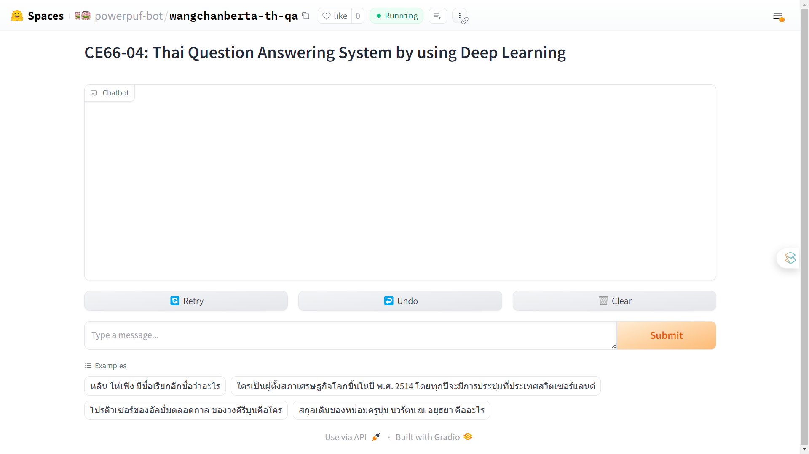

# Thai Question-Answering System Using Similarity Search and LLM

## Overview

This repository contains the implementation of a Thai Question-Answering (QA) system that leverages WangchanBERTa, Faiss for fast similarity search, and evaluates its performance on the Thai Wiki QA dataset. The proposed system efficiently matches user queries to relevant QA pairs, providing accurate and natural responses.

### Key Features

- **Fast Similarity Search:** Utilizes [Faiss](https://github.com/facebookresearch/faiss) for efficient similarity search among QA pairs.
- **WangchanBERTa Integration:** Incorporates [WangchanBERTa](https://huggingface.co/airesearch/wangchanberta-base-att-spm-uncased), a pretraining multilingual transformer-based model.
- **Semantic Search:** Implements [semantic search](https://doi.org/10.48550/arXiv.1908.10084) to enhance the accuracy of QA pair matching.

## Getting Started

### Web Demo



<p style="text-align: center;"><a href="https://huggingface.co/spaces/powerpuf-bot/wangchanberta-th-qa">https://huggingface.co/spaces/powerpuf-bot/wangchanberta-th-qa</a></p>

### Prerequisites

- Python 3.10
- Dependencies listed in `requirements.txt`

### Installation

```bash
pip install -r requirements.txt
```
